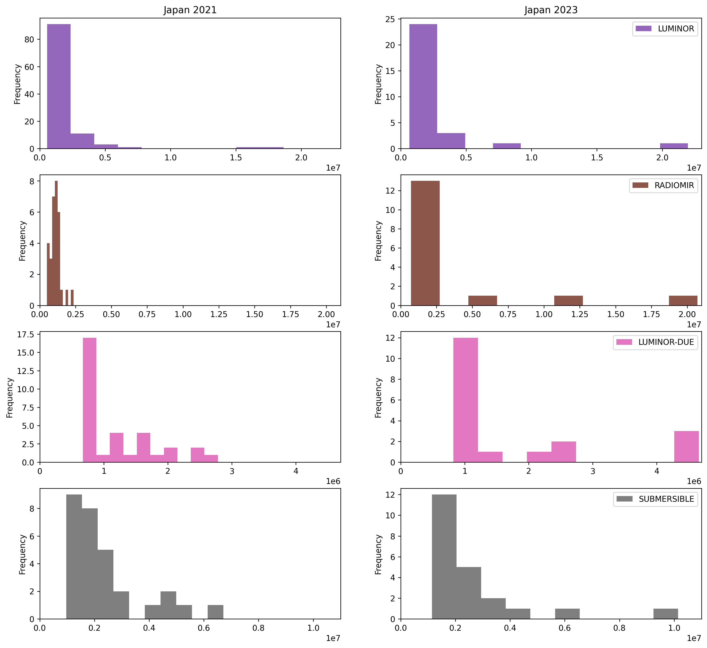
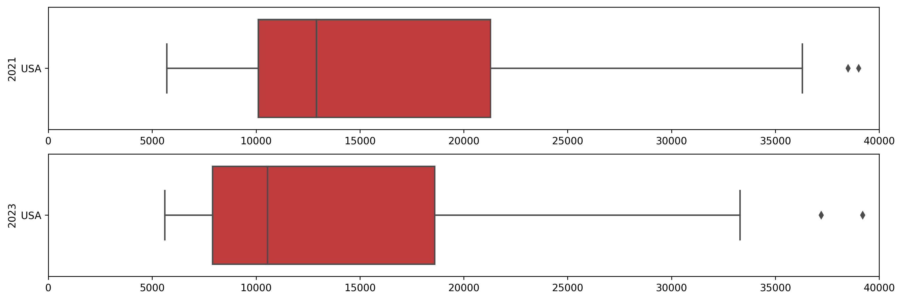

##### Thierry Ksstentini - Data&Data 19/06/2023
---

# Panerai market analysis
The purpuse of this document is to get an overview of the France, UK, USA and Japan Panerai markets between 2021 and today.

## The Panerai brand
Panerai is a luxury watch manufacturer founded in Italy (Florence) in 1860. It moved onto the international scene in 2001. Today, Panerai watches are divided into four collections : Submersible, Luminor, Luminor Due, Radiomir.

## Collection analysis
In this section, we compare our 2021 Panerai market data with the 2023 available on website. Mainly, we'll focus on the prices of the US, UK, Japan and France markets.

### Distribution
Since 2021, the part of each Panerai collection has evolved. This piecharts show the distribution of each collection regarding the country.

We see that the brand has drasticaly changed its product ditribution by moving toward a more homogenous distribution across collections.

Also, despite some specific watches, the Panerai proposal is the same in each of the four markets.

### New products and less products
Since 2021, new products has been released and some have been removed from the Panerai website. Regarding our data, Panerai has **reduced its available products by more than two**. Especially, Panerai has drasticaly reduced its LUMINOR proposal.

## Price analysis
### Overall markets
Despite a large distribution modification and a product reduction, the global aspect of Panerai markets has not drasticaly changed.

However, we can notice higher market prices for France and UK markets in 2023. This behavior, alongside a decreased of the USA prices, make the four markets more homogenous in 2023 even if USA is still slightly higher than the others.

***Note 1** : we removed the flagship outliers to focus on the main price ranges.*\
***Note 2** : prices have been converted to euros with the exchange rate of the respective years.*\
***Note 3** : since USA market is "excluded taxes", we took tax free prices (20% for France and UK, 10% for Japan).*

### Market by country
If we zoom a bit and take a look by country, we can judge of the evolution of each market since 2021. Keep in mind that we got rid of the outsiders *for box plots only* : they are Panerai exceptions which are part of its main market but its most luxurious and expensive products.

#### France
The French market seems getting more expensive : the minimum, maximum and median values have increased. Also the 2023 box third percentil is higher which means that (by keeping in mind the reduction of its products), Panerai offers less lower price products than previously.

By zooming into the collections, we can see they have not changed a lot : indeed, some flagships have arised since 2021 which increased the maximum price but the bulk of the market for each collection seems to remain practically unchanged. We find again the main of the LUMINOR collection between 5k€ and about 60k€ ; RADIOMIR collection between 5k€ and 20k€ (we can still notice some average+ price products at 40k€ and 80k€) ; LUMINOR-DUE spread out between 5k€ and 20k€ (but with less price options in this range than 2021) and finally, the SUBMERSIBLE collection is still between 5k€ and 50k€ where we can notice the removal of a flagship for an average+ 70k€ product.

#### UK
We can see a similar behavior with UK between 2021 and 2023 : the range of prices is larger for less products. But, in that case, the median is slightly lower than before.

Regarding collections, the UK market seems to be highly correlated with the French market. We can then see a similar evolution between 2021 and 2023 than for the French market.

#### Japan
Again, the Japan market seems to have increased and we found now a lot more products above 1,750,000¥. The minimum and maximum have also increased.

Here, we notice the same evolutions with the LUMINOR and RADIOMIR collections. Also like others, the LUMINOR-DUE collection market is less spread out than before with less price options between 1000k¥ and 3000k¥. However, unlike the French and UK markets, a flagship has popped in the SUBMERSIBLE collection at 10,000k¥.

#### USA
Finally, the market that has changed the most is the USA one. Prices have decreased with a median close to the 10,000$ (~20% lower than 2021). 

However, the price distribution does not seem to have changed (the box has roughly the same size) and the cheaper product is also the same.

The evolution of the USA market collection is very similar to the French and UK markets : we notice the same emergence of flagship products except for the SUBMERSIBLE collection.

## Conclusion
As a conclusion the company has been through a lot of changes since 2021. Firstly, the whole product offer has been reviewed by reducing the number of available products. Also, the collection market is now more homogenous and not dominated by LUMINOR products. 

Regarding prices, the French, UK and Japan markets seem to get higher or at least more spread to higher prices. However, the USA market seems to be the only one that have been reduced, more products are now available for lower prices than before.

Finally, if we take a look at each collection, the tendencies are almost similar for each market : Panerai seems to bet on new average+ price ranges on the one hand, and new flagship products on the other hand while maintaining a bulk at lower prices. Also, the SUBMERSIBLE collection seems to have been a success in Japan since Panerai has decided to add a flagship in it contrary to others where the SUBMERSIBLE flagship watch has been removed.